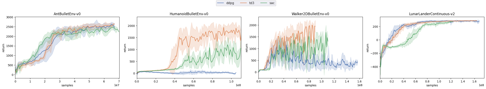

# TODO: Better documentation

# PyTorch-RL-IL (rlil): A PyTorch Library for Building Reinforcement Learning and Imitation Learning Agents

`rlil` is a library for reinforcement learning and imitation learning research. 
**The concept of this library is based on the [Autonomous Learning Library (ALL)](https://github.com/cpnota/autonomous-learning-library/tree/master/all) and [rlpyt](https://github.com/astooke/rlpyt).**

Some classes such as `Approximation`, `Agent` are almost the same as `ALL`.
For the basic concepts of these classes, see the original documentation: https://autonomous-learning-library.readthedocs.io/en/stable/. 

Unlike `ALL`, `rlil` uses an distributed sampling method, like `rlpyt`, which makes it easy to switch between offline and online learning.
Also, `rlil` utilizes a library of replay buffers `cpprb` written in cpython.

## Implemented Algorithms

### Reinforcement Learning

- [x] [`Deep DPG (DDPG)`](https://arxiv.org/abs/1509.02971)
- [x] [`Twind Dueling DDPG (TD3)`](https://arxiv.org/abs/1802.09477)
- [x] [`Soft Actor Critic (SAC)`](https://arxiv.org/abs/1801.01290)

### Imitation Learning

- [x] `Behavioral Cloning (BC)`
- [x] [`Generative Adversarial Imitation Learning (GAIL)`]( https://arxiv.org/abs/1606.03476): Our GAIL is implemented with off-policy algorithms. This off-policy GAIL is unstable.

### Distributed Sampling

- [x] `Asynchronous Sampling`
- [ ] `Synchronous Sampling`
- [ ] `Ape-X`: https://arxiv.org/abs/1803.00933. 